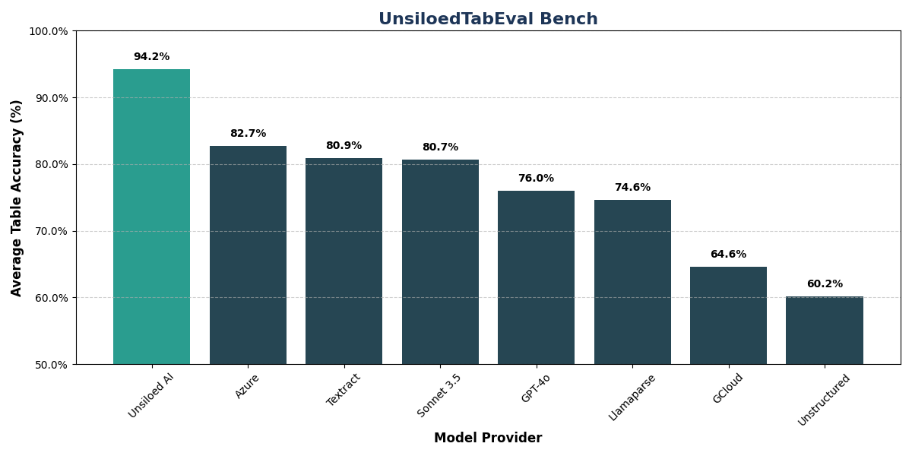

# UnsiloedAI Table Extraction Benchmark

This repository contains a benchmark for evaluating table extraction performance from images. The evaluation tool measures how accurately models can extract tabular data from images by comparing the extracted tables with ground truth.

## Quick Start

Run the evaluation tool with the default options:

```bash
uv run evaluation/eval_helper.py
```

This will:
1. Run the unsiloedvl-table model inference on the sample images
2. Evaluate the extraction performance
3. Output a summary of results

## Running on the Full Dataset

The repository includes a sample of images by default. To run the evaluation on the full dataset (1000 images):

1. Download the dataset from HuggingFace: https://huggingface.co/datasets/unsiloed-ai/UnsiloedTabEval
2. Extract the contents to the `evaluation` folder, preserving the directory structure:
   - `_images`: Contains the table images
   - `_groundtruth`: Contains the ground truth HTML tables


## Benchmarks




## Directory Structure

- `evaluation/`: Main directory for evaluation code and data
  - `_images/`: Contains test images
  - `_groundtruth/`: Contains ground truth HTML tables
  - `_predicted/`: Contains predictions and evaluation results
  - `eval_helper.py`: Main evaluation script
  - `parsing.py`: Parsing utilities
  - `grading.py`: Similarity scoring functions
  - `convert.py`: HTML to numpy conversion utilities

## Requirements

- Python 3.8+
- uv package manager
- Required packages will be installed automatically via uv
